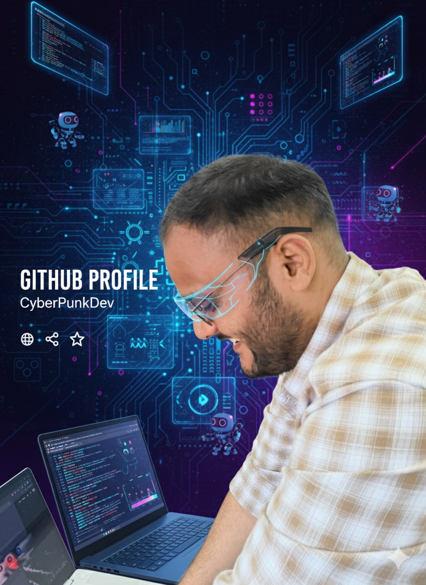

<!--
✨ Welcome to the ultra-animated, visually explosive GitHub profile of Shantanu Yadav! ✨
-->

<!-- Side-by-side Profile Image and Animated Typing Header using Table Layout for GitHub Markdown Support -->
<table>
  <tr>
    <td width="240" align="center" valign="top">
      
    </td>
    <td valign="middle">
      
    </td>
  </tr>
</table>

<!-- Colorful Coding Banner GIF -->

  

---

## 👋 Welcome!

> **“Dream. Build. Innovate. Repeat.”**

  

  <b>Location:</b> Jhansi, India 🇮🇳 &nbsp; | &nbsp; <b>Education:</b> BCA (Completed), MCA (Pursuing)  
  <b>Building real-world solutions with code and creativity!</b>

---

## 🛠️ Tech Stack & Skills

  

  
  
  
  
  

  
  
  
  

---

## 🌟 Key Projects & Achievements

<b>🛒 E-commerce Platform</b>

Connecting local shopkeepers to the digital economy, empowering small businesses through technology. 

<b>🛒🤖 Smart Cart System (IoT)</b>

Self-checkout shopping carts built with ESP32 & IoT for a seamless supermarket experience. 

<b>🎮 Game Application</b>

Fun, interactive game app designed for learning and entertainment. 

<b>🛰️ Ultrasonic Radar System</b>

Arduino-powered security system for border surveillance and real-time alerts. 

<b>🏪 RetailEdge (Patent Filed)</b>

A patented IoT platform for supermarkets: automating billing, inventory, and payments. 

<b>☁️ IaaS Cloud Platform</b>

Building a cloud infrastructure platform inspired by AWS EC2. 

---

## 🏅 Hackathons & Awards

  

- 🥇 **Winner:** IMS Ghaziabad Hackathon &nbsp;
- 🥇 **Winner:** MANIT Bhopal Hackathon &nbsp;
- 🏆 **Patent Filed:** RetailEdge IoT Supermarket Solution  
- 🎓 **Certified:** "Blockchain: Beyond the Basics" by Jonathan Reichental

---

## 🎈 Fun Facts, Hobbies & Interests

- 🚀 Tech innovation & start-ups
- 🛡️ Defence & security technologies
- 🌳 Environmental tech, truffle farming
- 🏋️ Fitness and holistic wellness
- 👥 Volunteering for **Green Bharat** project

  
   Always curious, always learning!

  
  
  

---

## 📫 Connect with Me

  
  
  
  

---

## ⚡ GitHub Stats & Activity

  
  

<!-- 

  

 -->

  

---

<h3 align="center">
    
  <b>Let’s code the future, together! 🌍 
  🚀 Open for collaboration, learning, and building impactful solutions! 🚀</b>
</h3>

  

<!--
NOTES:
- For best visual experience, all GIF links are taken from reliable sources (Giphy, raw.githubusercontent) to avoid 404 errors.
- For a truly spinning profile image, create a custom GIF with your image and overlay a spinner, then upload it to your repo or an image host.
- Add/remove GIFs to taste! 🚀
-->
